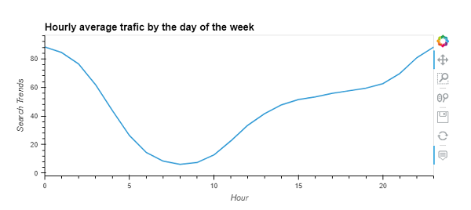
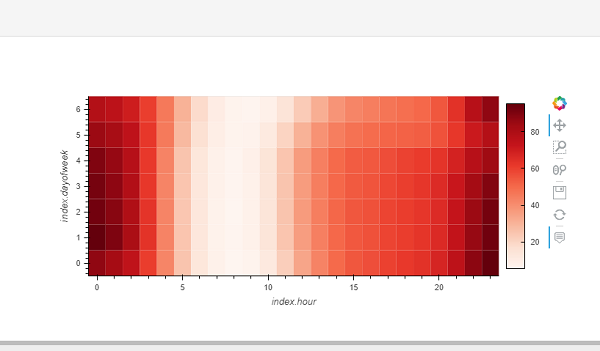
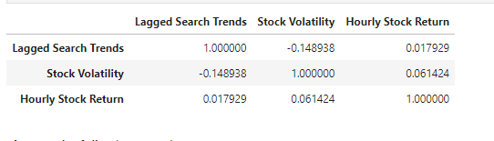
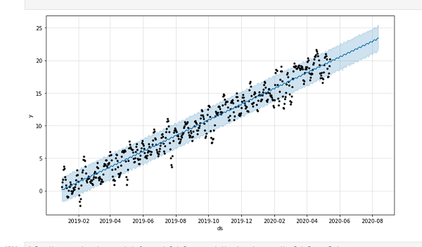

# Time Series Analysis

This repository is to utilizing the time series analysis to find trends in MercadoLibre financial and user data and to identify any correlation exist. Also, predict sales for next quarter by utilizing Facebook Prophet.

## Facebook Prophet

This API implements the Prophet open-source forecasting library for timeseries developed by Facebook's data science team. It's an additive regression model that combines a piece-wise linear component with yearly and monthly seasonal components, as well as a user-provided list of holidays. It works particularly well on timeseries that are seasonal, and is robust to missing data/outliers.

---

## Technologies

```python
Language: Python 3.9.12

Libraries used:

 Pandas
 Jupyter Labs
 Pathlib
 PyViz hvPlot
 Facebook Prophet

 ```

 ----


 ## Installation Guide

 ```python
 conda install pandas
 conda install jupyterlab
 conda install -c pyviz hvplot
 pip install - Prophet

 Check the to make sure everything has been installed properly

 conda list pandas
 conda list hvplot
 conda list jupyter lab
 conda list Prophet
 ```

 ----

 ## Usage

 To run this analysis jupyter lab notebook has been used. To run jupyter lab you need to use GitBash and navigate to where you have exported the files associated with this project and activate your dev environment. Next, this project can be ran by navigating to the crypto_investments.ipynb jupyter notebook file.

----

## Steps Taken

### Step 1: Find unusual patterns in hourly Google search traffic

### Step 2: Mine the search traffic data for seasonality




### Step 3: Relate the search traffic to stock price patterns



### Step 4: Create a time series model with Prophet


### Step 5 : Forecast revenue by using time series models




----

## Contributors

Brought to you by Amrita Prithiani

----

## License

MIT

